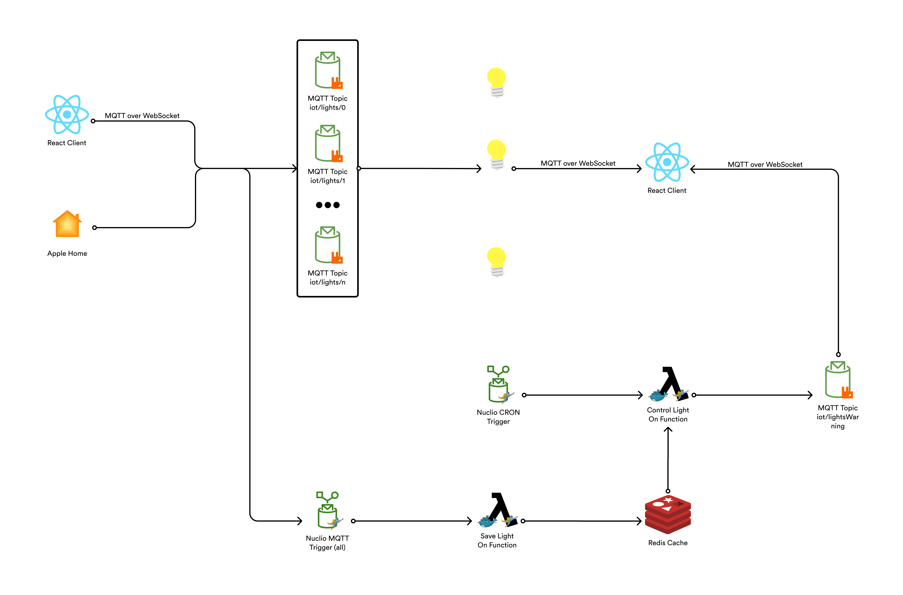

# LightsOn - Lights Management System

> Project developed by Salvatore Fasano for the “Serverless for IoT” course - University of Salerno 20/21

## Introduction

LightsOn allows you to manage lights in a simple way, you can use:

* the provided web application
* the services provided by Apple Home (yes, even with Siri)
* applications capable of sending messages on an MQTT topic.

You can turn on the lights, change the color of the light and obviously turn them off; there is also a control mechanism to avoid forgetting the lights on (and paying more electricity).

## Technologies

The following technologies were used:

* [Docker](https://docs.docker.com/) & [Docker Compose](https://docs.docker.com/compose/)

* [Nuclio](https://nuclio.io/) functions with MQTT and Cron Trigger

* [RabbitMQ](https://www.rabbitmq.com/) message broker

* [Redis](https://redis.io/) for a fast and simple cache storage

* [Nginx](https://www.nginx.com/) as web server and reverse proxy

* [Homebridge](https://homebridge.io/) to allow connection with Apple HomeKit

The following diagram shows the different components used and how they interact with each other.



The communication takes place entirely through the MQTT protocol except when interacting with the client, in which case MQTT over WebSocket is used.

## Installation

### Prerequisites

There are no operating system requirements.

Software:

* Docker & Docker Compose
* Homebridge

#### Docker

For macOS or Windows operating systems you can install Docker Desktop and go directly to [Homebridge](#Homebridge).

To install Docker on Linux you can use the Docker CE installation [guide](https://docs.docker.com/install/linux/docker-ce/ubuntu/#extra-steps-for-aufs).

```sh
$ sudo apt-get update
$ sudo apt-get install \
    apt-transport-https \
    ca-certificates \
    curl \
    software-properties-common
$ curl -fsSL https://download.docker.com/linux/ubuntu/gpg | sudo apt-key add -
$ sudo apt-key fingerprint 0EBFCD88
$ sudo add-apt-repository \
   "deb [arch=amd64] https://download.docker.com/linux/ubuntu \
   $(lsb_release -cs) \
   stable"
$ sudo apt-get update
$ sudo apt-get install docker-ce
```

**IMPORTANT FIX** Ubuntu 18.04 changed to use systemd-resolved to generate /etc/resolv.conf. Now by default it uses a local DNS cache 127.0.0.53. That will not work inside a container, so Docker will default to Google's 8.8.8.8 DNS server, which may break for people behind a firewall. Refers to the [Stackoverflow discussion](https://stackoverflow.com/questions/20430371/my-docker-container-has-no-internet).

```sh
sudo ln -sf /run/systemd/resolve/resolv.conf /etc/resolv.conf
```

#### Docker Compose

If you installed Docker with Docker Desktop, Docker Compose is already installed, skip to the next section.

Install Docker Compose using the Docker Compose installation [guide](https://docs.docker.com/compose/install/#install-compose).

```sh
$ sudo curl -L "https://github.com/docker/compose/releases/download/1.22.0/docker-compose-$(uname -s)-$(uname -m)" -o /usr/local/bin/docker-compose
$ sudo chmod +x /usr/local/bin/docker-compose
```

#### Homebridge

Homebridge must be active within your local network to be accessible by Apple devices.

It could be deployed within Docker like the other components, however you should use the --network host setting which, as described [here](), presents problems on systems other than Linux.

So to install Homebridge you need to have NodeJS installed. Just run the following line to proceed with the installation of Homebridge and the necessary components.

```sh
sudo npm install -g --unsafe-perm homebridge homebridge-config-ui-x homebridge-mqttthing
```

Now you have to start it as a service, depending on the system you will use a different manager.

```sh
# For macOS
sudo hb-service install

# For Windows
hb-service install

# For Ubuntu
sudo hb-service install --user homebridge
```

You can access to Homebridge UI by going to http://localhost:8581.

The default user is `admin` with password `admin`.

## Execution

All the necessary services have been collected in the docker-compose file to simplify the deployment and to enjoy the DNS made available by Docker within the custom created networks (this means using the container name as hostname, no IP addresses to modify).

To further simplify the deployment, a client image is also created: it was developed with React technology, in the multistage Dockerfile the build is made for production and then all the necessary files are inserted into an Nginx-based image.

Before you can start everything, you need to change the IP address in `nginx.conf` in line 10 with your IP address: Nginx is also used as a reverse proxy since the client uses Homebridge APIs that are closed to external access (CORS policy).

Now you need to run the following command.

```sh
docker-compose -f docker-compose.prod.yml up -d
```

To deploy the Nuclio functions there is no need to make changes, just access localhost: 8070, create a new project, import and deploy the functions from the `nuclio-functions/nuclio-light-on-control.yml` and `nuclio-functions/nuclio-save-light-on.js`: at the end of the .yml files it is specified in which docker network the containers must be located, again to take advantage of Docker's DNS.
